```mermaid
sequenceDiagram
  participant User as User
  participant InputParser as InputParser
  participant NumFilter as NumericDocumentFilter
  participant View as JPanel Views
  participant Dialog as DialogHelper
  participant Ctrl as Controller
  participant MotelMgt as MotelManagement
  participant Register as Register
  participant RoomMgr as RoomManager
  participant Turn as Turn
  participant FileMgr as FileManager
  participant App as App.java

  rect rgb(220, 240, 255)
    Note over App,FileMgr: 1. Application Startup
    App->>App: Acquire FileLock (single-instance guard)
    App->>MotelMgt: prepareProgramData()
    MotelMgt->>FileMgr: getJsonData("applicationProperties")
    FileMgr->>FileMgr: sanitizeFileName(name) -- null/empty/path-traversal guard
    FileMgr->>FileMgr: file.exists() -- file-existence check, null if missing
    FileMgr->>FileMgr: ObjectMapper.readValue(content) -- JSON parse guard, null on failure
    MotelMgt-->>MotelMgt: rawConfig == null -> firstBoot = true
    MotelMgt->>RoomMgr: restoreRoomStates(roomData)
    RoomMgr->>RoomMgr: roomData == null || isEmpty -> return early
    RoomMgr->>RoomMgr: index bounds per tower/floor/room -> skip with warning
    MotelMgt->>MotelMgt: prepareTurnRegisterData()
    MotelMgt->>FileMgr: getJsonData("turn") -- same file-existence + JSON parse chain
    MotelMgt->>MotelMgt: turnData == null || isEmpty -> skip loading
    MotelMgt->>Turn: setPreviousTurnJSON(turnData)
    Turn->>Turn: catch JsonProcessingException -> log warning, return false
    MotelMgt->>MotelMgt: !validPreviousTurn -> backup + end turn + generate report
    Ctrl-->>Ctrl: printer availability check -> fallback + user info
  end

  rect rgb(240, 240, 200)
    Note over User,NumFilter: 2. Input Entry Layer
    User->>View: Types/presses key
    View->>NumFilter: insertString / replace
    NumFilter->>NumFilter: isNumeric(text) -- null/empty -> reject
    NumFilter->>NumFilter: Long.parseLong(text) -> NumberFormatException -> reject
    User->>View: Clicks save / triggers action
    View->>InputParser: parseLongSafe(field / string)
    InputParser->>InputParser: field == null -> default
    InputParser->>InputParser: text == null || empty -> default
    InputParser->>InputParser: Long.parseLong -> NumberFormatException -> default
  end

  rect rgb(255, 220, 220)
    Note over Ctrl,Dialog: 3. Configuration Save Validation
    Ctrl->>Dialog: showNumericInputDialog
    Dialog->>Dialog: text.isEmpty() -> return null
    alt MotelDataConfigurationController.onSave()
      Ctrl->>Ctrl: name.isEmpty() || id.isEmpty() || address.isEmpty()
      Ctrl->>Dialog: showInfoMessage("Todos los campos...deben estar llenos")
      Ctrl->>Dialog: confirmDialog -> user must accept
    else First-boot path (configureForFirstBoot)
      Ctrl->>Ctrl: Same empty-field guard
      Ctrl->>Dialog: showInfoMessage -> block save
    end
    alt FloorConfigurationController
      Ctrl->>Ctrl: floorListIndex < 0 -> "Seleccione un piso primero"
      Ctrl->>Ctrl: towerIndex < 0 -> return early
      Ctrl->>Dialog: confirmDialog for delete/discard operations
    end
  end

  rect rgb(230, 255, 230)
    Note over Ctrl,RoomMgr: 4. Room Operations
    alt Booking / Time Extension
      Ctrl->>RoomMgr: getRoom(t,f,r)
      RoomMgr->>RoomMgr: index bounds -> return reception (dummy)
      Ctrl->>Ctrl: slotIndex < 0 || >= timeData.length -> return early
      Ctrl->>Ctrl: updateRoomPrice(delta) -- newPrice > 0? clamp
    else Room Swap
      Ctrl->>RoomMgr: changeRoomTimeToAnother(currentTime)
      RoomMgr->>RoomMgr: desiredChangeRoom.status == OCCUPIED -> return false
      Ctrl->>Ctrl: roomChangeSelected -- status == OCCUPIED -> "NO DISPONIBLE"
    else Room Configuration
      View->>View: RoomConfigurationView -- Long.parseLong -> NumberFormatException -> 0
      View->>View: price < 0 -> clamp to 0
      View->>View: duration <= 0 || price <= 0 -> skip save
    end
    RoomMgr->>RoomMgr: getRemainingTimeRoom -- endStatus == null -> "0:0"
    RoomMgr->>RoomMgr: getStartTimeRoom / getStartDateRoom -- startStatus == null -> "N/A"
    Ctrl->>Ctrl: remainingTime.contains("-") -> overtime flag = true
  end

  rect rgb(255, 240, 200)
    Note over Ctrl,Register: 5. Transactions (Selling / Spending)
    alt Selling
      Ctrl->>Ctrl: updateItemSaleAmount -- newValue < 0 -> clamp to 0
      Ctrl->>Register: consumeRegisterListForSale()
      Register->>Register: sellingListConsumed == true -> IllegalStateException
      Register->>Register: decrement inventory quantity for each CartItem
      Ctrl->>Dialog: No print? confirmPrinting() -> user consent
    else Spending
      Ctrl->>Ctrl: value == 0L && concept not empty -> "El valor...debe ser distinto de cero"
      Ctrl->>Ctrl: value != 0L && concept empty -> operation guarded (no-op)
    end
  end

  rect rgb(240, 220, 255)
    Note over Turn: 6. Turn Activity Type Guards
    Turn->>Turn: TurnDetails.fromJson -- switch(changeType)
    Turn->>Turn: unknown type -> IllegalArgumentException
    Turn->>Turn: activityIndex (refund/reverse) < 0 -> return early
    Turn->>Turn: instanceof checks before downcast -> conditional branch
    Turn->>Turn: updatedItems.isEmpty() -> remove activity instead of replacing
  end

  rect rgb(255, 235, 235)
    Note over FileMgr,FileMgr: 7. Persistence Layer (FileManager) -- Full Chain
    FileMgr->>FileMgr: sanitizeFileName -- null/empty -> "unnamed"
    FileMgr->>FileMgr: Write to .tmp file -> IOException -> log + return
    FileMgr->>FileMgr: AtomicMove .tmp->target -> IOException -> log + fallback
    FileMgr->>FileMgr: Fallback move -> IOException -> log + data at risk
    FileMgr->>FileMgr: listFiles() == null -> return early (deleteDirectory)
    FileMgr->>FileMgr: Files.list(path) -> IOException -> log
    FileMgr->>FileMgr: ObjectMapper.readValue(content) -> JsonProcessingException -> log warning, skip file
  end

  rect rgb(230, 230, 250)
    Note over Turn,MotelMgt: 8. Enum Parse Guards (JSON Deserialization)
    Turn->>Turn: RoomStatus.fromCode(code) -- switch default -> IllegalArgumentException
    Turn->>Turn: ActivityType.fromString(s) -- no match -> IllegalArgumentException
    Turn->>Turn: RefundType.fromString(s) -- no match -> IllegalArgumentException
    Turn->>Turn: ExtraChangeType.fromString(s) -- no match -> IllegalArgumentException
    Turn->>Turn: TurnDetails.fromJson -- unknown changeType -> IllegalArgumentException
  end

  rect rgb(250, 240, 230)
    Note over TurnReportGenerator: 9. TurnReportGenerator -- Type Dispatch Guards
    TurnReportGenerator->>TurnReportGenerator: instanceof check per activity type -> continue
    TurnReportGenerator->>TurnReportGenerator: items.isEmpty() -> return early (skip section)
    TurnReportGenerator->>TurnReportGenerator: label.isEmpty() -> skip style application
  end

  rect rgb(245, 245, 210)
    Note over HistoryService: 10. HistoryService -- Malformed Entry Guard
    HistoryService->>HistoryService: catch(Exception) per history file -> log warning + skip
  end
```

#  Sequence Diagram

## Validation Summary

| Layer | Validation Type | Error Handling |
|-------|----------------|----------------|
| Startup | Single-instance lock, file existence, JSON parse | exits, null returns, log.warning |
| Input Entry | Null/empty, NumberFormatException | Silent default, input rejection |
| Configuration | Empty required fields, selection state | User-facing DialogHelper.showInfoMessage |
| Room Operations | Index bounds, occupancy status, price range | Dummy object return, clamp, early return |
| Transactions | List consumption guard, non-negative quantity | IllegalStateException, clamp, dialog |
| Turn Activities | Unknown type string, index bounds, instanceof | IllegalArgumentException, early return |
| Persistence | File existence, JSON parse, atomic move | Fallback retry, log error |
| Enum Parsing | Unmatched string -> throw | IllegalArgumentException |
| Report Generation | Type dispatch, empty checks | continue, early return |

